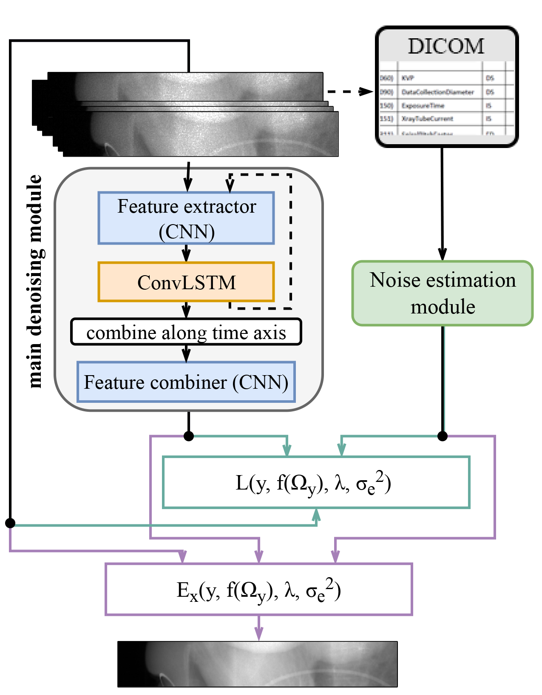
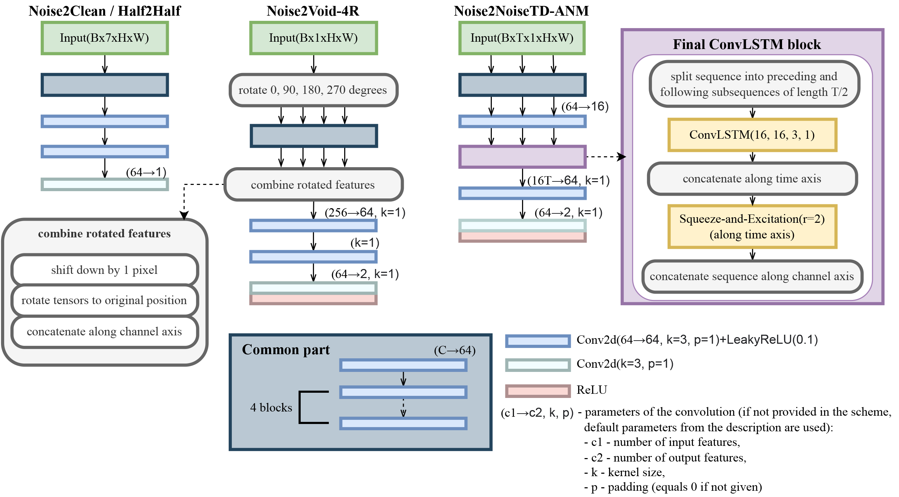

# Self-supervised Physics-based Denoising for Computed Tomography

PyTorch implementation of the paper *["Self-supervised Physics-based Denoising for Computed Tomography" (arXiv)](https://arxiv.org/abs/2211.00745), 
Elvira Zainulina, Alexey Chernyavskiy, Dmitry V. Dylov*.

**Abstract:**

*Computed Tomography (CT) imposes risk on the patients due to its inherent X-ray radiation, 
stimulating the development of low-dose CT (LDCT) imaging methods. 
Lowering the radiation dose reduces the health risks but leads to 
noisier measurements, which decreases the tissue contrast and causes
artifacts in CT images. Ultimately, these issues could affect the 
perception of medical personnel and could cause misdiagnosis. 
Modern deep learning noise suppression methods alleviate the challenge 
but require low-noise-high-noise CT image pairs for training, 
rarely collected in regular clinical workflows. In this work, 
we introduce a new self-supervised approach for CT denoising 
Noise2NoiseTD-ANM that can be trained without the high-dose 
CT projection ground truth images. Unlike previously proposed 
self-supervised techniques, the introduced method exploits 
the connections between the adjacent projections and the actual 
model of CT noise distribution. Such a combination allows for 
interpretable no-reference denoising using nothing but the 
original noisy LDCT projections. Our experiments with LDCT 
data demonstrate that the proposed method reaches the level 
of the fully supervised models, sometimes superseding them, 
easily generalizes to various noise levels, and outperforms 
other self-supervised denoising algorithms.*

The scheme of the proposed self-supervised method for denoising CT projections:
<p align="center">


The proposed approach was compared to the Noise2Clean, [Half2Half](https://pubmed.ncbi.nlm.nih.gov/32707565/) 
and [Noise2Void-4R](https://papers.nips.cc/paper/2019/file/2119b8d43eafcf353e07d7cb5554170b-Paper.pdf) approaches 
using the same backbone neural network architecture (DnCNN):
<p align="center">


## Requirements
- [PyTorch](https://pytorch.org/)
- [pydicom](https://github.com/pydicom/pydicom) (A package for working with DICOM files)
- [piq](https://github.com/photosynthesis-team/piq) (A collection of measures and metrics for image quality assessment)
- [TIGRE](https://github.com/CERN/TIGRE) (A package for reconstructing CT slices from CT projections)

## Usage
### Data
Projections from the [Low Dose CT Image and Projection Data (LDCT-and-Projection-data)](https://wiki.cancerimagingarchive.net/pages/viewpage.action?pageId=52758026#52758026171ba531fc374829b21d3647e95f532c)
have been used.

### Training a model

Run `python train.py --help` for a complete listing of command line parameters and support list of training configurations.

```
usage: train.py [-h] [--fd_dir FD_DIR] [--ld_dir LD_DIR]
                    [--test_size TEST_SIZE] [--simulated]
                    [--num_adj_prj NUM_ADJ_PRJ] [--approach APPROACH] [--inv]
                    [--mse] [--epochs EPOCHS] [--logpath LOGPATH]
                    [--models_path MODELS_PATH] [--nw_path NW_PATH]

optional arguments:
  -h, --help            show this help message and exit
  --fd_dir FD_DIR       Path to the clean (full-dose) projections, if exists
  --ld_dir LD_DIR       Path to the noisy (low-dose) projections
  --val_size VAL_SIZE
                        Pass the coefficient for splitting data if the dataset
                        should be splitted into train and validation sets
  --simulated           Pass if the low-dose data is simulated(projections are
                        npz arrays with names of type file_name.dcm.npz)
  --num_adj_prj NUM_ADJ_PRJ
                        Number of adjacent projections from one side to use
                        (>=0)
  --approach APPROACH   Approach to use: nc - Noise2Clean, nv - Noise2Void-4R, 
                        td - Noise2NoiseTD-ANM
  --inv                 Pass if to train in the projection domain (p), not in
                        the transmission domain (exp(-p))
  --mse                 Pass if to train a model using MSE loss (only for the
                        self-supervised mode)
  --epochs EPOCHS       Number of epochs
  --logpath LOGPATH     Path to save logs
  --models_path MODELS_PATH
                        Path to save models
  --nw_path NW_PATH     Path to the pre-trained noise weights, if any
```
Before training on the selected low-dose projections ensure that the dataset does not contain trash projections (~2000 projections at the beginning and at the end of the set). 
In the `train.py`proper `MIN_V`, `MAX_V` should be set (they are used only to calculate metrics, do not affect the training process).

To train a network on arbitrary low-dose projections from the LDCT dataset run
```
python train.py --ld_dir=./ld_dir --num_adj_prj=3 --approach=td --epochs=500 --logpath=./log_dir --models_path=./models_dir --nw_path=../pretrained_models/noise_weights.pth
```

### Inference

Run `python inference.py --help` for a complete listing of command line parameters and support list of configurations.
```
usage: inference.py [-h] [--fd_dir FD_DIR] [--ld_dir LD_DIR] [--simulated]
                    [--num_adj_prj NUM_ADJ_PRJ] [--approach APPROACH] [--inv]
                    [--mse] [--dm_path DM_PATH] [--nm_path NM_PATH]
                    [--dest_path DEST_PATH]

optional arguments:
  -h, --help            show this help message and exit
  --fd_dir FD_DIR       Path to clean (full-dose) data, if exists
  --ld_dir LD_DIR       Path to noisy (low-dose) data
  --simulated           Pass if the low-dose data is simulated(projections are
                        npz arrays with names of type file_name.dcm.npz)
  --num_adj_prj NUM_ADJ_PRJ
                        Number of adjacent projections from one side to use (>=0)
  --approach APPROACH   Approach to use: nc - Noise2Clean, nv - Noise2Void-4R, 
                        td - Noise2NoiseTD-ANM
  --inv                 Pass if the model was trained in the projection
                        domain, not in the transmission domain
  --mse                 Pass if the model was trained using MSE loss (only for
                        the self-supervised mode)
  --dm_path DM_PATH     Path to the denoising model
  --nm_path NM_PATH     Path to the noise model
  --dest_path DEST_PATH
                        Path to save denoised predictions
```

To evaluate a trained network run

```
python inference.py --fd-dir=./fd_dir --ld-dir=./fd_dir --num_adj_prj=3 --approach=td --dm_path=../pretrained_models/trained_on_25/N2NTDDnCNN.pth --nm_path=../pretrained_models/trained_on_25/N2NTDDnCNN_Noise.pth --dest_path=./predictions.npy
```

### Trained models

The `pretrained models` directory contains weights for models:

* `pretrained_models/trained_on_25` - contains weights of the models trained on low-dose projections made at 25% of the routine dose;
* `pretrained_models/trained_on_5` - contains weights of the models trained on low-dose projections made at 5% of the routine dose;
* `pretrained_models/` - contains pre-trained weigths of the noise model and weights of the Noise2NoiseTD-ANM model (DnCNN-based) trained on the projections with real noise;
